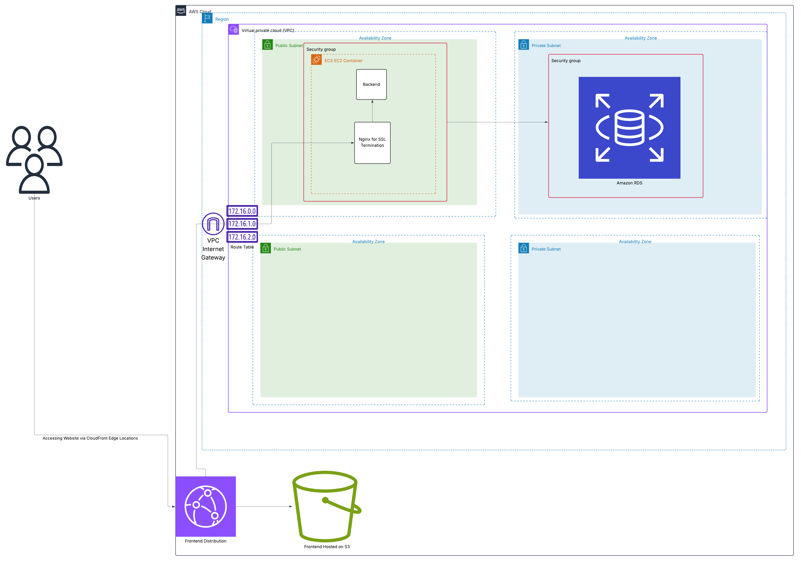

# Tasks Management Application

A full-stack task management application built with Spring Boot (Backend) and React + Vite (Frontend).




## 🏗️ Architecture Overview

- **Frontend** – React 19, TypeScript, Vite, Tailwind CSS, `@dnd-kit` for drag-and-drop, React Query for data fetching.
- **Backend** – Spring Boot 3 (Java 25), Spring Security (JWT), Spring Data JPA, PostgreSQL 17, structured JSON logging with MDC enrichment.
- **Infrastructure** – ECS cluster backed by EC2 host running Docker (Spring Boot backend) + RDS + (S3+Cloudfront for frontend), with CloudWatch Agent shipping logs and metrics.

See the Decision Records in [`docs/adr`](./docs/adr) for detailed rationale.

## 📚 Documentation

- [ADR-001: Frontend Task Board Architecture](./docs/adr/001-frontend-task-board-architecture.md)
- [ADR-002: Backend Task Service Architecture](./docs/adr/002-backend-task-service-architecture.md)
- [ADR-003: Infrastructure & Observability Strategy](./docs/adr/003-infrastructure-observability-strategy.md)
- `docs/` will also host production runbooks, diagrams, and CloudWatch insights references.

## 📋 Prerequisites

- Docker and Docker Compose
- Make (optional, but recommended)
- Java 25 (for local development without Docker)
- Node.js 18+ (for local development without Docker)
- Maven 3.8+ (for local development without Docker)

## 🚀 Quick Start with Docker

### Using Make (Recommended)

```bash
# View all available commands
make help

# Setup environment files
make setup-env

# Start development environment
make dev

# View logs
make logs
```

### Using Docker Compose Directly

If `make` is not available on your system, use these Docker Compose commands:

```bash
# Build and start all services
docker compose up --build -d

# Start all services (without building)
docker compose up -d

# View logs for all services
docker compose logs -f

# View logs for specific service
docker compose logs -f backend
docker compose logs -f frontend
docker compose logs -f postgres

# Restart services
docker compose restart

# Restart specific service
docker compose restart backend
docker compose restart frontend

# Stop all services
docker compose down

# Stop and remove volumes (deletes all data)
docker compose down -v

# Check service status
docker compose ps
```

## 📝 Environment Configuration

### Backend Configuration

Copy the example environment file and configure:

```bash
cp backend/.env.example backend/.env
```

Edit `backend/.env` with your configuration:

```env
# Database Configuration
DB_HOST=localhost
DB_PORT=5432
DB_NAME=tasks_management
DATABASE_USERNAME=postgres
DATABASE_PASSWORD=postgres

# CORS Configuration
CORS_ALLOWED_ORIGINS=http://localhost:*

# JWT Configuration (Optional - defaults provided)
JWT_ACCESS_TOKEN_EXPIRATION=1800000
JWT_REFRESH_TOKEN_EXPIRATION=604800000
```

### Frontend Configuration

The frontend uses environment variables prefixed with `VITE_`:

- `VITE_API_URL`: Backend API URL (default: `http://localhost:8080/api`)
- `VITE_APP_NAME`: Application name (default: `Tasks Management`)

These can be configured in the root `.env` file or passed via `compose.yaml`.

### CloudWatch Logs

The backend emits structured JSON logs in production with MDC (Mapped Diagnostic Context) enrichment for distributed tracing:

```json
{
  "timestamp": 1759374928030,
  "level": "INFO",
  "thread": "http-nio-8080-exec-1",
  "logger": "tech.omarshabaan.tasksmanagement.service.auth.AuthService",
  "message": "Token refreshed successfully for user: omarshabaan.dev@gmail.com",
  "mdc": {
    "traceId": "734b1cf3-9559-49ab-aa32-d50e8359122c",
    "userId":"0199a11e-fa81-7dd5-8e41-6b929da9e173"
  }
}
```

**CloudWatch Logs Insights Queries**:
- Track user sessions: `fields @timestamp, mdc.traceId, message | filter mdc.userId like "0199a11e-fa81-7dd5-8e41-6b929da9e173`
- Monitor authentication flows: `fields @timestamp, mdc.traceId, message | filter logger like /AuthService/ | sort @timestamp desc`
- Trace request lifecycle: `fields @timestamp, message | filter mdc.traceId = "734b1cf3-9559-49ab-aa32-d50e8359122c"`


## 🛠️ Development

### Available Make Commands

#### Service Management
```bash
make dev              # Start development environment
make dev-build        # Build and start development environment
make dev-logs         # Show development logs
make up               # Start all services
make down             # Stop all services
make restart          # Restart all services
make restart-backend  # Restart only backend
make restart-frontend # Restart only frontend
```

#### Logs
```bash
make logs             # Show logs for all services
make logs-backend     # Show backend logs
make logs-frontend    # Show frontend logs
make logs-db          # Show PostgreSQL logs
```

#### Database
```bash
make db-reset         # Reset PostgreSQL (deletes all data)
make db-shell         # Access PostgreSQL shell
```


#### Cleanup
```bash
make clean            # Remove all containers and volumes
make clean-hard       # Nuclear cleanup (removes everything)
make clean-volumes    # Remove only volumes
```

#### Health & Status
```bash
make health           # Check health of all services
make status           # Show status of all services
```

### Local Development (Without Docker)

**Note:** Java 25 requires the `-Dnet.bytebuddy.experimental=true` flag for ByteBuddy compatibility.

#### Backend

```bash
cd backend

# Install dependencies
./mvnw clean install -Dnet.bytebuddy.experimental=true

# Run the application
./mvnw spring-boot:run -Dspring-boot.run.jvmArguments=-Dnet.bytebuddy.experimental=true

# Run tests
./mvnw test -Dnet.bytebuddy.experimental=true

# Package the application
./mvnw clean package -Dnet.bytebuddy.experimental=true
```

#### Frontend

```bash
cd frontend

# Install dependencies
npm install

# Start development server
npm run dev

# Build for production
npm run build

# Run linting
npm run lint

# Format code
npm run format
```

## 🌐 Accessing the Application

Once the services are running:

- **Frontend**: http://localhost:5173
- **Backend API**: http://localhost:8080/api
- **Spring REST Docs**: http://localhost:8080/docs.html
- **Actuator Health**: http://localhost:8080/actuator/health
- **PostgreSQL**: localhost:5432

## 📚 API Documentation

The API documentation is available in two formats:

1. **Swagger UI**: Interactive API documentation at `/swagger-ui/index.html`
2. **Spring REST Docs**: Comprehensive documentation at `/docs/index.html`

## 🗄️ Database

### Accessing PostgreSQL

Using Make:
```bash
make db-shell
```

Using Docker Compose directly:
```bash
docker compose exec postgres psql -U myuser -d mydatabase
```

### Database Migrations

The application uses Spring Data JPA with automatic schema generation in development mode. For production, consider using Flyway or Liquibase for versioned migrations.

### Resetting the Database

**⚠️ WARNING: This will delete all data!**

```bash
make db-reset
```

## 🏗️ Project Structure

```
tasks-management/
├── backend/                   # Spring Boot backend
│   ├── src/
│   │   ├── main/
│   │   │   ├── java/         # Java source code
│   │   │   └── resources/    # Configuration files
│   │   └── test/             # Test files
│   ├── .env.example          # Example environment variables
│   ├── .dockerignore         # Docker ignore for development (includes certs)
│   ├── .dockerignore.prod    # Docker ignore for production (excludes certs)
│   ├── Dockerfile            # Multi-stage Docker build (development)
│   ├── Dockerfile.native     # GraalVM native build (production)
│   └── pom.xml               # Maven dependencies
├── frontend/                 # React frontend
│   ├── src/                  # React source code
│   ├── public/               # Static assets
│   ├── Dockerfile            # Multi-stage Docker build
│   └── package.json          # NPM dependencies
├── infrastructure/           # Infrastructure configuration
├── docker-compose.yaml       # Main Docker Compose file
├── docker-compose.override.yaml  # Development overrides
├── Makefile                  # Development commands
└── README.md                 # This file
```

## 🔒 Security

### JWT Authentication

The application uses JWT tokens for authentication:

- **Access Token**: Short-lived token for API requests (default: 30 minutes)
- **Refresh Token**: Long-lived token stored in HTTP-only cookie (default: 7 days)

### RSA Key Pair

The application uses RSA keys for signing JWT tokens. Keys are located in `backend/src/main/resources/certs/`. (USED FOR DEVELOPMENT ONLY) 
- TODO even in development, consider using environment variables or a secrets manager for better security. (to be implemented)

To generate new keys:

```bash
cd backend/src/main/resources/certs

# create rsa key pair
openssl genrsa -out keypair.pem 2048

# extract public key
openssl rsa -in keypair.pem -pubout -out public.pem

# create private key in PKCS#8 format
openssl pkcs8 -topk8 -inform PEM -outform PEM -nocrypt -in keypair.pem -out private.pem
```

## 🧪 Testing

### Backend Tests

The backend uses **Testcontainers** to spin up real PostgreSQL instances for integration tests, ensuring tests run against the actual database without mocking.

```bash

# Or using Maven directly
cd backend && ./mvnw -Dnet.bytebuddy.experimental=true clean verify


```

**Testcontainers Configuration**:
- Located at `backend/src/test/java/tech/omarshabaan/tasksmanagement/TestcontainersConfiguration.java`
- Automatically starts PostgreSQL 17 container for tests
- Uses `@ServiceConnection` for automatic Spring Boot configuration
- Container is reused across test classes for better performance
- No manual database setup or cleanup required

### Frontend Tests

```bash
cd frontend

# Run tests
npm test

# Run tests with coverage
npm run test:coverage
```

## 🔄 CI/CD Pipeline

The project uses GitHub Actions for continuous integration and deployment with separate workflows for backend and frontend.

### Backend CI/CD

**CI Pipeline** (`.github/workflows/backend-ci.yaml`)
- **Trigger**: Pull requests to `main` branch affecting `backend/` files
- **Java Version**: 25 (Eclipse Temurin)
- **Steps**:
  1. Code formatting validation with `spring-javaformat`
  2. Build and run tests with coverage using Testcontainers
  3. Upload coverage reports to Codecov
- **Caching**: Maven dependencies cached for faster builds

**Deployment Pipeline** (`.github/workflows/deploy-backend.yaml`)
- **Trigger**: Push to `main` branch affecting `backend/` files
- **Authentication**: AWS credentials via OIDC (no long-lived keys)
- **Build Process**:
  1. Build & test with Spring REST Docs generation
  2. Build GraalVM native image using `Dockerfile.native`
  3. Swap to `.dockerignore.prod` (excludes RSA certs)
  4. Push to Amazon ECR with timestamp + commit SHA tag
- **Deployment**:
  1. Update ECS task definition with new image
  2. Deploy to ECS cluster with rolling update
  3. Wait for service stability (CloudFormation stack health)

### Frontend CI/CD

**CI Pipeline** (`.github/workflows/frontend-ci.yaml`)
- **Trigger**: Pull requests to `main` branch affecting `frontend/` files
- **Node Version**: 23.11.0
- **Steps**:
  1. Run ESLint for code quality checks
  2. Run Prettier for formatting validation
  3. Execute tests with coverage
  4. Upload coverage to Codecov

**Deployment Pipeline** (`.github/workflows/deploy-frontend.yaml`)
- **Trigger**: Push to `main` branch affecting `frontend/` files
- **Build Process**:
  1. Build optimized production bundle with Vite
  2. Generate source maps and assets
- **Deployment**:
  1. Sync build artifacts to S3 bucket
  2. Invalidate CloudFront cache for immediate updates
  3. Verify deployment via CloudFront distribution

### Key Features

- **Fast deployments**:
  - Backend: ~5 second startup time with GraalVM native image (1GB RAM)
  - Frontend: Instant via CloudFront cache invalidation
  - Small downtime window during ECS task replacement (cost-optimized single-instance setup)
- **Security**: OIDC authentication, no long-lived AWS credentials
- **Observability**: Coverage reports, deployment logs, CloudWatch integration
- **Automated testing**: Testcontainers for backend, Vitest for frontend
- **Docker layer caching**: GitHub Actions cache for faster builds

### Possible Improvements

- **Zero-downtime deployments**: Implement ECS blue/green deployment with ALB target groups
- **Automatic rollback**: Add CloudWatch alarms to trigger automatic rollback on deployment failures
- **Multi-AZ deployment**: Run multiple ECS tasks across availability zones (higher cost)
- **Health checks**: Enhanced ECS health checks with custom application endpoints

## 🚀 Deployment

### Docker Configuration

The project uses different Docker configurations for development and production:

- **Development** (`Dockerfile`): Uses `.dockerignore` which includes RSA certs for local development
- **Production** (`Dockerfile.native`): GitHub Actions swaps to `.dockerignore.prod` which excludes RSA certs (keys are injected via secrets)


### AWS Infrastructure

The project includes AWS CloudFormation templates for production deployment in the `infrastructure/` directory:

#### CloudFormation Stacks

1. **VPC Stack** (`vpc.yaml`)
   - VPC with 2 public and 2 private subnets
   - Internet Gateway and route tables
   - Multi-AZ setup for high availability
   - CIDR: 10.0.0.0/16

2. **Backend Stack** (`backend.yaml`)
   - ECS cluster with EC2 launch type
   - RDS PostgreSQL instance
   - CloudWatch Logs integration
   - Auto-scaling configuration
   - ALB for load balancing

3. **Frontend Stack** (`frontend.yaml`)
   - S3 bucket for static hosting
   - CloudFront distribution with SSL
   - Custom domain support via Route 53
   - CORS configuration

4. **SSL Certificate** (`ssl-us-east-1.yaml`)
   - ACM certificate for CloudFront (us-east-1 region)
   - Domain validation configuration

#### Deployment Order

```bash
# 1. Deploy VPC
aws cloudformation create-stack \
  --stack-name ejada-vpc \
  --template-body file://infrastructure/vpc.yaml

# 2. Deploy SSL certificate (us-east-1)
aws cloudformation create-stack \
  --stack-name ejada-ssl \
  --template-body file://infrastructure/ssl-us-east-1.yaml \
  --region us-east-1

# 3. Deploy backend
aws cloudformation create-stack \
  --stack-name ejada-backend \
  --template-body file://infrastructure/backend.yaml \
  --parameters ParameterKey=VpcStackName,ParameterValue=ejada-vpc

# 4. Deploy frontend
aws cloudformation create-stack \
  --stack-name ejada-frontend \
  --template-body file://infrastructure/frontend.yaml
```

### Environment Variables for Production

Ensure all sensitive environment variables are properly set:

- `DATABASE_PASSWORD`: Strong database password
- `JWT_SECRET`: Strong secret for JWT signing
- `COOKIE_SECURE`: Set to `true` for HTTPS
- `CORS_ALLOWED_ORIGINS`: Restrict to your production domain

## 🐛 Troubleshooting

### Backend not starting

1. Check if PostgreSQL is healthy:
   ```bash
   docker compose ps
   ```

2. Check backend logs:
   ```bash
   make logs-backend
   ```

3. Verify database connection:
   ```bash
   make db-shell
   ```

### Frontend not loading

1. Check frontend logs:
   ```bash
   make logs-frontend
   ```

2. Verify API URL is correct in environment variables

3. Check CORS configuration in backend

### Database connection errors

1. Ensure PostgreSQL is running:
   ```bash
   docker compose ps postgres
   ```

2. Verify database credentials match between backend `.env` and `compose.yaml`

3. Try resetting the database:
   ```bash
   make db-reset
   ```

### Port conflicts

If you have port conflicts, you can change the default ports in your `.env` file:

```env
BACKEND_PORT=8081
FRONTEND_PORT=5174
DB_PORT=5433
```
