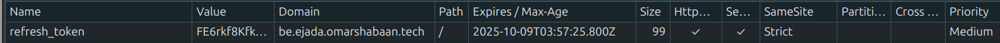

# ADR-002: Backend Task Service Architecture

## Status
Accepted

## Context

The Spring Boot service exposes RESTful endpoints for managing tasks, authenticates users via JWT, and persists data to PostgreSQL. We need clear guidance on pagination semantics, status transitions, and observability hooks so that future features (reporting, automation, integrations) can rely on predictable backend behaviour.

Key requirements:

1. **0-based pagination** compatible with Spring Data and frontend expectations.
2. **Task lifecycle** with well-defined status transitions the UI can enforce.
3. **Structured logging** enriched with MDC (Mapped Diagnostic Context) for traceability.
4. **CloudWatch readiness** so container logs can be shipped with minimal reconfiguration.
5. **Secure authentication flow** combining short-lived access tokens with HttpOnly refresh cookies.
6. **Documentation automation** through Spring REST Docs to keep API contracts current.
7. **Native image compatibility** for GraalVM/Spring Boot native builds.
## Decision

1. **Pageable controllers** use Spring Data's `Pageable` and `Page<Task>` types; responses are serialised as `{ content, page }` where `page.number` is 0-based.
2. **TaskStatus enum** remains the single source of truth (`PENDING`, `IN_PROGRESS`, `COMPLETED`, `CANCELLED`). Service methods validate transition rules (e.g., completed tasks can be reopened but cancelled tasks require explicit confirmation).
3. **Structured logging profiles** – Logback exposes two console appenders: a pattern-based `PLAIN` layout for `dev`/`test` profiles, and an AWS-compatible JSON encoder for the default/production profile. MDC entries include `traceId` and `userId` seeded by the interceptor.
4. **CloudWatch integration** – container stdout/stderr is shipped via the CloudWatch Agent; because logs are already JSON (outside of dev/test), no additional parsing layer is required.
5. **Authentication flow** – access tokens are short-lived JWTs returned in the response body while refresh tokens are signed, HttpOnly cookies scoped to `/` with `SameSite=Strict`. The backend rotates refresh tokens and returns a new cookie on successful refresh.
6. **Database identifiers** – entities use surrogate numeric primary keys internally (`id`) while exposing stable UUIDs (`uuid`) in API payloads to avoid leaking sequential database IDs.
7. **REST documentation** – controllers are instrumented with Spring REST Docs tests that generate snippets (`build/generated-snippets`) assembled into the published documentation.
8. **Native image support** – maintain `src/main/resources/META-INF/native-image/.../reflect-config.json` so validators, password rules, and bytecode providers required at runtime are retained when building a Spring Boot native executable.

## Rationale

- Spring Data already surfaces 0-based pagination and request binders; leaning on it reduces boilerplate and keeps filtering consistent.
- The frontend board expects the four statuses; having central validation in the service prevents accidental drift between clients.
- MDC lets us stamp every log line with request-specific context; when combined with CloudWatch Logs Insights we can trace actions across services.
- Emitting JSON logs keeps the observability pipeline agnostic—local development can tail plain text, while production uses CloudWatch without format conversion.

## Implementation Notes

- **Controller contract**: `/api/tasks/me` receives `page` and `size` query parameters (default `page=0`, `size=20`). Responses include:
  ```json
  {
    "content": [ { "uuid": "…", "title": "…" } ],
    "page": {
      "number": 0,
      "size": 20,
      "totalElements": 57,
      "totalPages": 3
    }
  }
  ```
- **Validation**: Service methods throw `BadRequestException` when transitions violate business rules; the exception handler maps these to HTTP 400 with machine-readable codes.
- **MDC wiring**: `LoggingContextInterceptor` (Spring MVC `HandlerInterceptor`) generates a UUID `traceId`, derives the `userId` from `CustomUserDetails` (falling back to `anonymousUser`/`unknown`), writes both into MDC on `preHandle`, and clears MDC on `afterCompletion`.
- **Log configuration**: `logback-spring.xml` binds appenders to Spring profiles. `dev`/`test` profiles reference the `PLAIN` layout for easy console reads; the default profile references the AWS JSON encoder so production logs include MDC fields suitable for CloudWatch Logs Insights.
- **Authentication mechanics**: Successful login returns an access token (default 30-minute expiry) and sets a `refresh_token` cookie flagged `HttpOnly`, `Secure` (in production), `SameSite=Strict`, as illustrated in the cookie capture below. Refresh endpoints validate the cookie, issue a new JWT, rotate the refresh token, and reset the cookie expiration.
- **Identifiers**: Entities store a numeric surrogate `id` for relational integrity and a generated `uuid` (exposed via DTOs) to keep public URLs stable and conceal internal sequence values.
- **REST Docs**: Integration tests under `backend/src/test/java/...` use Spring REST Docs to capture request/response snippets. The Gradle/Maven build assembles them into static docs served under `/docs/index.html`, keeping API documentation in sync with code.
- **Native image**: Native builds depend on `reflect-config.json` to list reflection-dependent classes (custom validators, Passay rules, Hibernate bytecode provider). Keep the file updated when adding reflection-heavy components to avoid `NoSuchMethodException` at runtime.

## Consequences

- API consumers (including the React frontend) must always read from the `content` array and inspect the `page` object for additional fetches.
- Tests and mocks require updated DTOs to reflect the paginated shape; fixtures should include realistic `totalElements` counts.
- Structured logging may increase log volume; CloudWatch retention policies should be configured to avoid excessive storage costs.

## Cookie Security Configuration

The refresh token cookie is configured with the following security attributes for production environments:

- **`HttpOnly`**: Prevents JavaScript access to the cookie, mitigating XSS attacks
- **`Secure`**: Ensures the cookie is only sent over HTTPS connections (disabled in development for localhost)
- **`SameSite=Strict`**: Prevents the cookie from being sent in cross-site requests, protecting against CSRF attacks
- **Path=/**: Cookie is sent with all requests to the application
- **Max-Age**: Set to refresh token expiration (default 7 days)

The cookie configuration is illustrated in the screenshot below, showing all security flags enabled in a production environment:



**Development Note**: In local development (`COOKIE_SECURE=false`), the `Secure` flag is disabled to allow cookie transmission over HTTP for localhost testing.
